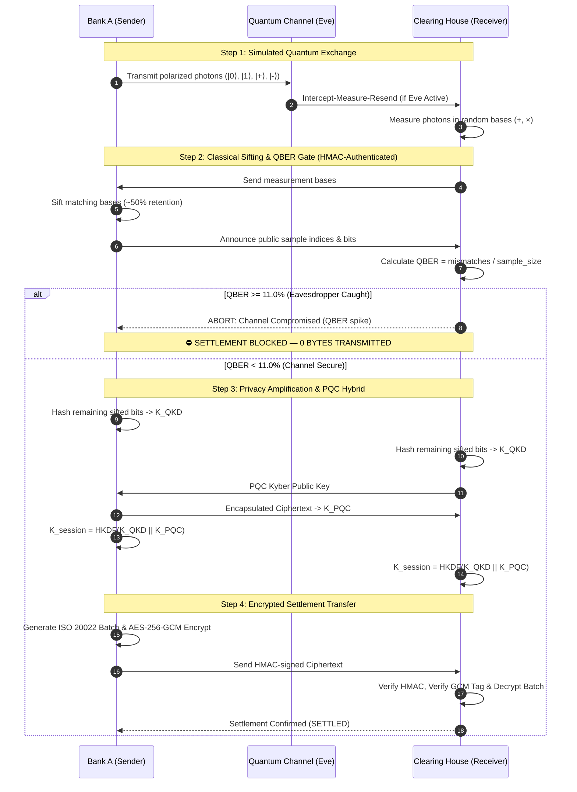

# FinTech QKD: Quantum-Resilient Security for Interbank Settlement

> **University Project & Institutional Prototype**  
> Demonstrating Point-to-Point Quantum Key Distribution (BB84) with Continuous Per-Settlement Re-Keying, Post-Quantum Kyber Hybridization, and AES-256-GCM Encryption for High-Value Interbank Settlement Links.

---

## 1. Executive Summary & Fintech Framing

In wholesale banking, high-value interbank settlement links (e.g., between **Bank A** and a central **Clearing House / RTGS**) transport billions in value daily. Traditional public-key infrastructure (RSA, ECDH) faces catastrophic vulnerability under Shor's algorithm on quantum computers ("Store Now, Decrypt Later" threats).

**FinTech QKD** secures this backbone link using **Quantum Key Distribution (QKD)** paired with **Post-Quantum Cryptography (PQC)**. 
- **Point-to-Point Topology**: QKD is a dedicated physical link technology engineered for fixed interbank backbones, *not* consumer retail apps.
- **Continuous Per-Settlement Re-Keying**: Every single financial settlement batch triggers an independent BB84 quantum exchange and derives a fresh, unique session key.
- **Immediate Eavesdrop Gate**: If an adversary (Eve) wiretaps the optical fiber, the Quantum Bit Error Rate (QBER) instantly spikes above the safety threshold ($\ge 11\%$). The system aborts immediately, blocking settlement before any financial data is exposed.

---

## 2. What is Real vs. Simulated

To ensure total academic transparency:

| Component | Status | Technical Implementation |
| :--- | :--- | :--- |
| **Network & Transport** | **REAL** | Real physical TCP sockets and WebSockets across two separate laptops or LAN nodes. |
| **Payload Encryption** | **REAL** | Authenticated AES-256-GCM symmetric cipher with 96-bit random nonces and 128-bit authentication tags. |
| **Classical Channel Auth** | **REAL** | Pre-Shared Key (PSK) with HMAC-SHA256 and sequence numbers (prevents MITM on classical reconciliation). |
| **Post-Quantum Layer** | **REAL** | NIST FIPS 203 ML-KEM / Kyber lattice-based key encapsulation combined with QKD keys via HKDF-SHA256. |
| **Financial Transactions**| **REAL** | Standardized synthetic ISO 20022 `pacs.008` interbank credit transfer settlement batches. |
| **Operations UI** | **REAL** | Real-time institutional browser console powered by FastAPI and WebSockets. |
| **Quantum Channel** | *Simulated* | Software-emulated BB84 photon polarization state preparation, random measurement bases, wavefunction collapse, and Qiskit quantum circuit backend. (Emulated because physical fiber-QKD lasers/single-photon detectors cost \$100k+, mirroring real-world bank testbeds). |

---

## 3. Architecture & Protocol Sequence



---

## 4. Installation & Setup

### Prerequisites
- Python 3.10+ (Tested on Python 3.10 – 3.14)
- Git

### 1. Clone & Install Dependencies

```bash
# Clone the repository
git clone https://github.com/sindhujareddy22/FinTech-QKD-Quantum-Resilient-Cryptographic-Framework-for-Secure-Financial-Transactions.git
cd "FinTech-QKD-Quantum-Resilient-Cryptographic-Framework-for-Secure-Financial-Transactions"

# Create and activate virtual environment
# Windows (PowerShell):
python -m venv .venv
.\.venv\Scripts\pip install -r requirements.txt

# macOS / Linux:
python3 -m venv .venv
source .venv/bin/activate
pip install -r requirements.txt
```

---

## 5. How to Run

### Mode A: Single-Laptop Development (Two Terminals)

Open two terminal windows on the same machine:

**Terminal 1 (Clearing House Node — Receiver):**
```bash
python main.py --role clearing --port 8001 --peer-port 8000
```

**Terminal 2 (Bank A Node — Sender):**
```bash
python main.py --role bank --port 8000 --peer-port 8001
```

Open your browser to:
- **Bank A Console**: [http://localhost:8000](http://localhost:8000)
- **Clearing House Console**: [http://localhost:8001](http://localhost:8001)

---

### Mode B: Two Separate Computers on Same Wi-Fi / Local Network

Run **Bank A (Sender)** on Machine A and **Clearing House (Receiver)** on Machine B.

#### Step 1: Connect Both Computers to the Same Network
Connect both computers to the same Wi-Fi router or a phone mobile hotspot (hotspots avoid corporate client isolation).

#### Step 2: Find the IP Address of Each Machine
- **Windows**: Open PowerShell or Command Prompt, run:
  ```powershell
  ipconfig
  ```
  Look for the **IPv4 Address** under `Wireless LAN adapter Wi-Fi` or `Ethernet adapter Ethernet` (e.g., `192.168.1.45` or `192.168.136.189`).
- **macOS / Linux**:
  ```bash
  ipconfig getifaddr en0
  # or
  hostname -I
  ```

> [!IMPORTANT]
> When running the commands below, replace the IP addresses with your actual numeric IPs. **Do not include the `<` or `>` symbols in your command.**

---

#### Step 3: Start Machine B — Clearing House (Receiver) FIRST
Open terminal in the project directory on **Machine B**:

- **Windows (PowerShell)**:
  ```powershell
  .\.venv\Scripts\python.exe main.py --role clearing --host 0.0.0.0 --port 8001 --peer-host <MACHINE_A_IP> --peer-port 8000
  ```
  *(Note: If Machine A is using port 8080, set `--peer-port 8080`)*

- **macOS / Linux**:
  ```bash
  python3 main.py --role clearing --host 0.0.0.0 --port 8001 --peer-host <MACHINE_A_IP> --peer-port 8000
  ```

- **Open Web Console on Machine B**: [http://localhost:8001](http://localhost:8001)  
  *(Do **not** type `0.0.0.0:8001` into your browser address bar; use `localhost:8001` to avoid `ERR_ADDRESS_INVALID`).*

---

#### Step 4: Start Machine A — Bank A (Sender) SECOND
Open terminal in the project directory on **Machine A**:

- **Windows (PowerShell)**:
  ```powershell
  .\.venv\Scripts\python.exe main.py --role bank --host 0.0.0.0 --port 8000 --peer-host <MACHINE_B_IP> --peer-port 8001
  ```

- **macOS / Linux**:
  ```bash
  python3 main.py --role bank --host 0.0.0.0 --port 8000 --peer-host <MACHINE_B_IP> --peer-port 8001
  ```

- **Open Web Console on Machine A**: [http://localhost:8000](http://localhost:8000) (or `http://localhost:8080` if using port 8080).

> [!TIP]
> **If Port 8000 is Already in Use on macOS (`[Errno 48] Address already in use`):**
> 1. **Option A (Kill lingering process)**: Run `lsof -ti :8000 | xargs kill -9` then retry `--port 8000`.
> 2. **Option B (Use Port 8080)**:
>    - **Machine A (Bank on Mac)**:
>      ```bash
>      python3 main.py --role bank --host 0.0.0.0 --port 8080 --peer-host <MACHINE_B_IP> --peer-port 8001
>      ```
>      Browser: [http://localhost:8080](http://localhost:8080)
>    - **Machine B (Clearing on Windows)**:
>      ```powershell
>      .\.venv\Scripts\python.exe main.py --role clearing --host 0.0.0.0 --port 8001 --peer-host <MACHINE_A_IP> --peer-port 8080
>      ```
> 3. **If `ModuleNotFoundError: No module named 'cryptography'` occurs**:
>    Run `pip install -r requirements.txt` before launching `main.py`.

---

#### Step 5: Windows Firewall Note
If Windows Defender prompts with a firewall alert when starting the server:
- Check **Private networks** and click **Allow access**.
- To allow traffic manually on Windows (run PowerShell as Administrator):
  ```powershell
  New-NetFirewallRule -DisplayName "FinTech QKD Link" -Direction Inbound -LocalPort 8000,8001,8080 -Protocol TCP -Action Allow
  ```

---

## 6. Live Demonstration Script ("Works $\to$ Caught $\to$ Recovers")

Follow this sequence during your university capstone presentation or lab demo:

1. **Normal Settlement (Clean Channel)**:
   - On the **Bank A** console, ensure **Attacker Simulation (Eve)** is **OFF**.
   - Click **SETTLE BATCH**.
   - **Observe**: QBER measures `0.0%`, channel pill stays **SECURE (Green)**, and the settlement batch appears in the ledger as **SETTLED (Green)**.
   - Click **View Payload** to inspect the decrypted ISO 20022 `pacs.008` interbank JSON payload.

2. **Eavesdropping Attack (Eve Appears)**:
   - On **Bank A**, flip the **Attacker Simulation (Eve)** toggle to **ON**.
   - Click **SETTLE BATCH** (or leave Auto-Stream running).
   - **Observe**: The QBER immediately spikes to $\sim 25.0\%$ (well above the $11.0\%$ threshold).
   - The status changes to **COMPROMISED (Red)**, the banner displays `Eavesdropper detected — settlement blocked`, and the batch is marked **BLOCKED (Red)**.
   - **Security Guarantee**: No plaintext or financial transaction data was ever transmitted over the network.

3. **Instant Recovery**:
   - Flip **Attacker Simulation (Eve)** to **OFF**.
   - Click **SETTLE BATCH**.
   - **Observe**: The next settlement immediately resets QBER to `0.0%`, status returns to **SECURE**, and the batch settles successfully.

4. **Ciphertext Tampering Demo (AES-GCM Auth Tag Failure)**:
   - Flip **TAMPER CIPHERTEXT** to **ON**.
   - Click **SETTLE BATCH**.
   - **Observe**: Even though the quantum channel succeeds, the Clearing House detects the flipped ciphertext byte via the AES-256-GCM authentication tag and rejects the payload with `CRITICAL SECURITY ALERT: AES-256-GCM authentication tag verification failed!`.

---

## 7. Test Suite & Evaluation Benchmark

### Run Automated Tests
```bash
pytest -v
```
*Validates 20 unit and integration tests across QKD photon physics, Eve injection rates, AES-GCM tamper detection, PQC key encapsulation, and classical HMAC authentication.*

### Run Academic Monte Carlo Benchmark
```bash
python benchmark_detection.py --rounds 500 --photons 600
```
This generates:
- **False Positive Rate (FPR)**: $0.00\%$ under clean quantum conditions.
- **Eavesdrop Detection Rate (TPR)**: $100.00\%$ when Eve performs intercept-measure-resend.
- **Photon Sizing Sweep**: Empirically proves how increasing photon pulses ($N=60 \to 600$) contracts QBER standard deviation ($\sigma \propto 1/\sqrt{N}$) to ensure rock-solid stability.
- **Publication Plot**: Output saved to `benchmark_results.png`.

---

## 8. Academic Analysis: Limitations of QKD & The Hybrid Defense

1. **Distance Constraints**: Pure QKD optical signals degrade over distance in optical fibers ($\sim 0.2\text{ dB/km}$ loss), limiting unrepeatered links to $\approx 100\text{--}150\text{ km}$. Because quantum states cannot be cloned or amplified by standard optical repeaters without collapsing the wavefunction, quantum repeaters (requiring quantum memory) are still experimental.
2. **Why QKD Fits Fixed Interbank Links**: Central banks, national clearing houses, and primary dealer banks operate over dedicated metro dark-fiber corridors (e.g. Wall Street $\leftrightarrow$ New Jersey data centers, or City of London $\leftrightarrow$ Docklands), making point-to-point QKD ideal.
3. **Authentication Necessity**: QKD by itself does not authenticate identity; active MITM attackers could negotiate separate keys with each endpoint. Our system solves this by requiring pre-shared key HMAC-SHA256 authentication on all classical reconciliation frames.
4. **Why PQC Hybrid (ML-KEM)**: Combining QKD ($K_{\text{QKD}}$) with lattice-based PQC ($K_{\text{PQC}}$) provides **defense-in-depth**: even if a fiber is cut or eavesdropped, or if a quantum computer breaks a mathematical assumption, the financial link remains unconditionally secure as long as *either* layer holds.
